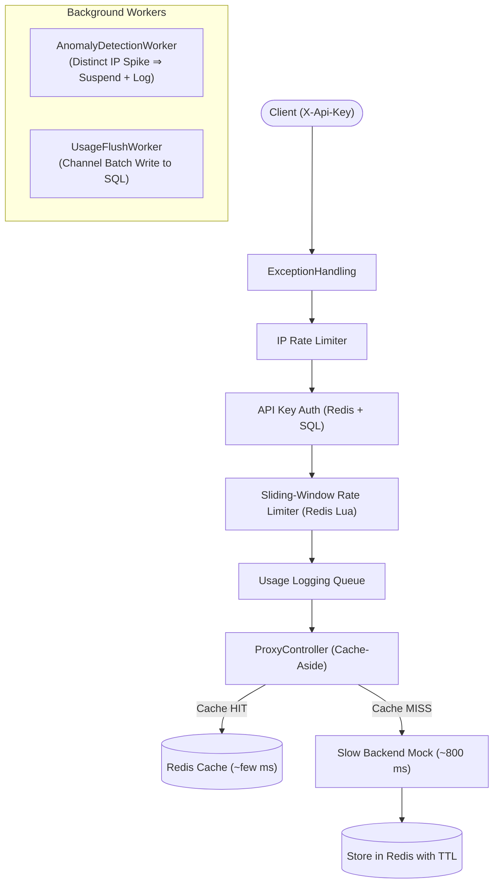
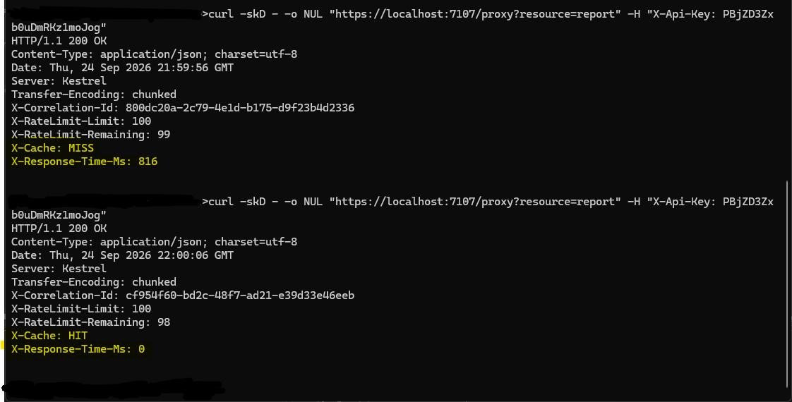
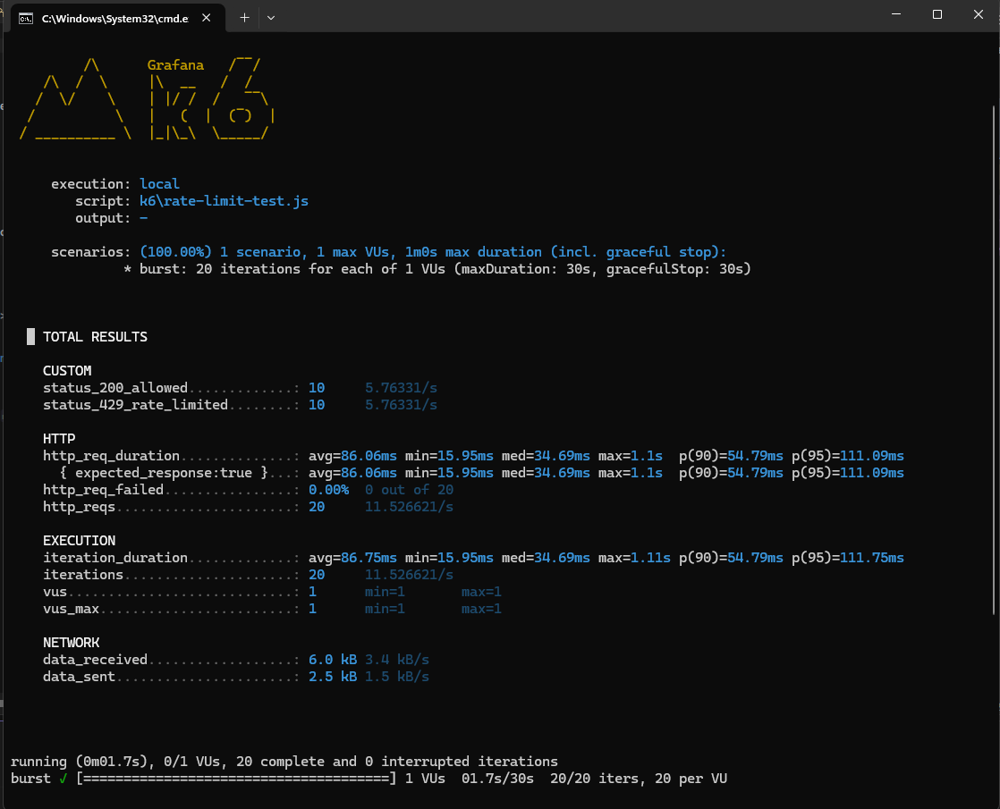
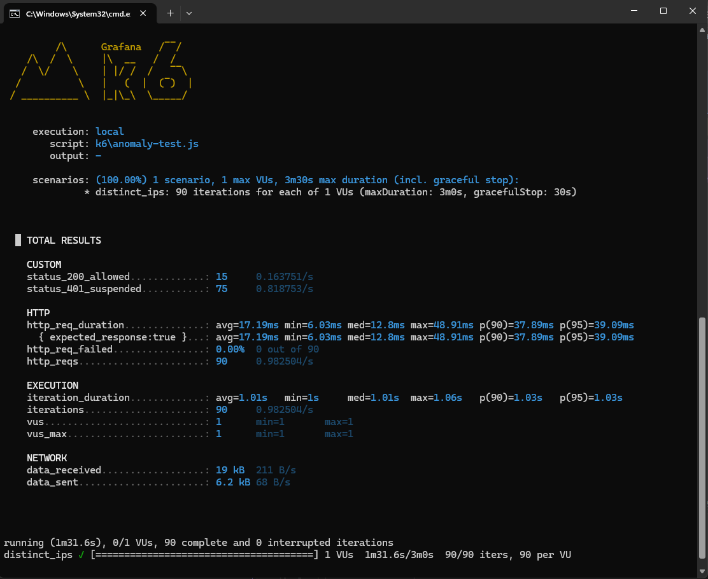
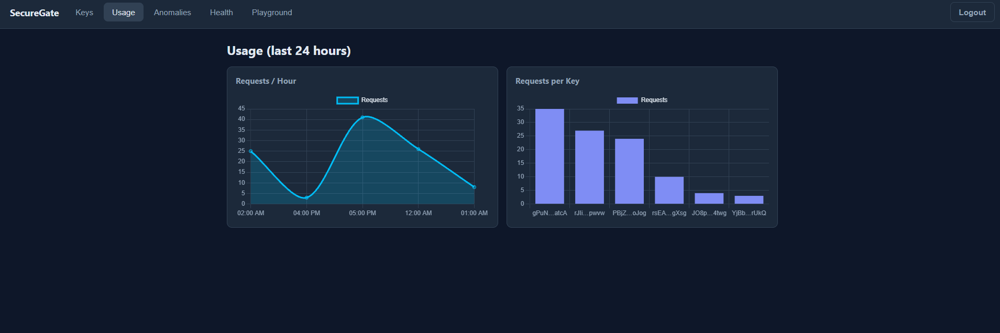
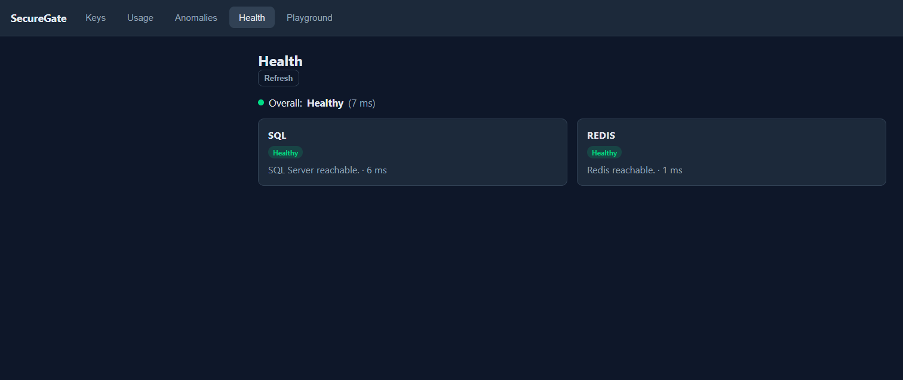
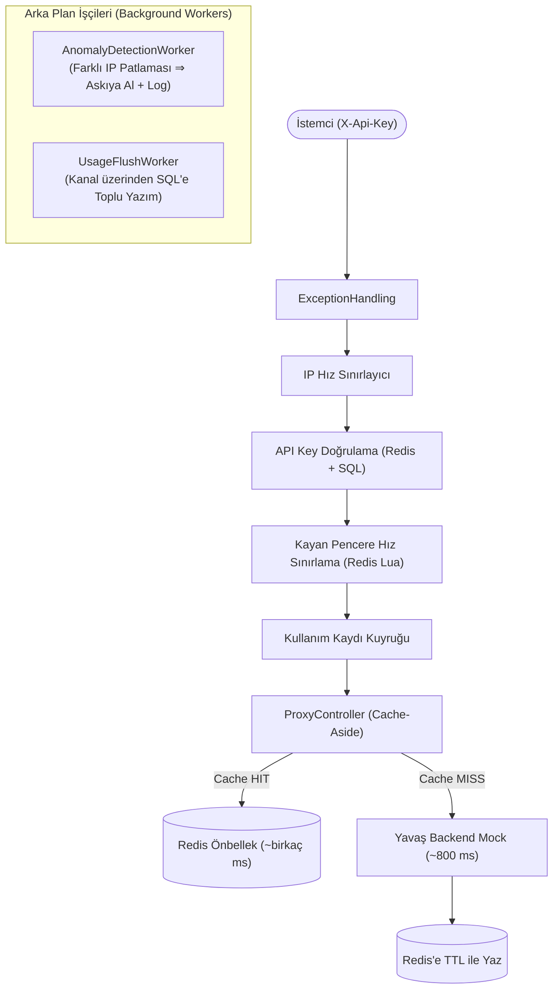

# SecureGate


**An API management & rate‑limiting gateway built with .NET, Clean Architecture and CQRS.**

**Language / Dil:** [🇬🇧 English](#english) · [🇹🇷 Türkçe](#türkçe)

---

<a id="english"></a>

## English

SecureGate sits in front of a backend service and handles the cross‑cutting concerns an API gateway is responsible for: **API‑key authentication, plan‑based rate limiting, response caching, abuse/anomaly detection, and admin management** — so the service behind it doesn't have to.

> The backend behind the gateway is a **mock** with a deliberate, simulated **800 ms delay** (standing in for a slow upstream such as image processing or a third‑party API). This is intentional: it gives the caching layer a *real, measurable* latency to remove, so the cache benefit can be proven with actual `Stopwatch` measurements rather than made‑up numbers. In production you would swap the mock for a real backend — the gateway logic doesn't change.

**Contents:** [Features](#en-features) · [Architecture](#en-architecture) · [Tech stack](#en-tech-stack) · [Design decisions](#en-design) · [Notes & deliberate choices](#en-notes) · [Results](#en-results) · [Admin dashboard](#en-dashboard) · [API reference](#en-api) · [Getting started](#en-getting-started) · [Testing](#en-testing) · [CI](#en-ci) · [Future work](#en-future)

<a id="en-features"></a>

### Features

- **API‑key authentication** — `X-Api-Key` validated at the edge; only `/proxy` traffic is guarded.
- **Sliding‑window rate limiting** — per‑key, backed by Redis with an **atomic Lua script**. Returns `429` + `Retry-After`.
- **Per‑IP rate limiting** — throttles by client IP *before* the key lookup, so a flood of bogus keys can't hammer SQL.
- **Cache‑aside** — Redis response cache with **stampede protection**. `X-Cache: HIT/MISS` and `X-Response-Time-Ms` headers.
- **Anomaly detection** — a `BackgroundService` auto‑suspends a key used from too many distinct IPs, writes an `AnomalyLog`, and invalidates the auth cache.
- **JWT admin auth** — role‑based (`Admin`) endpoints to manage keys, plans, and read usage & anomalies.
- **Admin dashboard** — a lightweight HTML/CSS/JS SPA served from the API.
- **Resilience** — the backend call is wrapped in Polly retry + circuit breaker + timeout.
- **Observability** — Serilog structured logging + correlation id (`X-Correlation-Id`); `/health` checks SQL and Redis.

<a id="en-architecture"></a>

### Architecture

Clean Architecture with a strict dependency rule (`Domain ← Application ← Infrastructure ← Api`):

```
SecureGate.Domain          Entities, enums, repository interfaces (no dependencies)
SecureGate.Application      CQRS (MediatR), DTOs, validators, service abstractions
SecureGate.Infrastructure  EF Core + SQL Server, Redis, background workers, resilience
SecureGate.Api             Controllers, middleware pipeline, JWT, Swagger, the dashboard
SecureGate.Tests           xUnit v3 unit + Redis integration tests
```

**`/proxy` request pipeline:**



<a id="en-tech-stack"></a>

### Tech stack

.NET 10 · ASP.NET Core Web API · MediatR · FluentValidation · AutoMapper · EF Core + SQL Server · Redis (StackExchange.Redis) · JWT (role‑based) · Polly · Serilog · xUnit v3 · k6 · HTML/CSS/JS + Chart.js · Docker Compose · GitHub Actions · Swagger.

<a id="en-design"></a>

### Design decisions

- **Mock backend & the 800 ms delay** — the subject is the *gateway*, not the backend. A fixed delay simulates a slow upstream so the cache's value is real and measurable (800 ms MISS → a few ms HIT). The *work* is simulated; the *measurement* is real.
- **True sliding window, not fixed window** — a Redis sorted set + a single atomic Lua script, so there's no boundary‑burst gap and no race between "count" and "record".
- **Negative caching + per‑IP limiting** — unknown/suspended keys are cached briefly so repeated bogus keys don't hit SQL; a per‑IP limit stops a distributed flood of *distinct* bogus keys.
- **Lightweight cache model** — only a small `CachedApiKey` is cached, never the EF entity, so no navigation graph or secret (e.g. a password hash) can leak into Redis.
- **Cache stampede protection** — on a miss, a keyed lock lets only one request hit the slow backend while the rest read the freshly cached value.
- **Cache degrades gracefully** — if Redis is unavailable the request still succeeds (cache is a speed‑up, not a source of truth); the backend call is retried and circuit‑broken.

<a id="en-notes"></a>

### Notes & deliberate choices

- **Configuration via `appsettings.json`, not a `.env` file — on purpose.** .NET has a first‑class configuration system (`IConfiguration`) that layers `appsettings.json`, `appsettings.{Environment}.json`, environment variables and user‑secrets, with environment variables overriding the files. A `.env` file is a Node.js convention and would be redundant/non‑idiomatic here. Local defaults live in `appsettings.json`; **production secrets (JWT key, connection strings) are supplied via environment variables**, which override the committed defaults without any `.env`.
- **The committed JWT key and SA password are dev‑only** — they let the project run out of the box locally. Override them with environment variables / a secrets manager in production.
- **HTTPS uses the local dev certificate** — tools hitting the API directly (k6, curl) may need `--insecure-skip-tls-verify` locally.
- **Some components are single‑node by design** — the cache‑stampede keyed lock and the in‑memory usage queue live in the process; horizontal scaling would swap them for a distributed lock and a shared queue/broker.
- **Usage statistics are aggregated in memory** over the recent window (fine at demo scale; a large dataset would move this to a SQL aggregation).
- **CORS is permissive in development** (any origin when none is configured); set `Cors:AllowedOrigins` to lock it down in production.
- **No user self‑registration** — a single admin user is seeded; the dashboard's "create key" uses that seeded user id (a real system would add user management).

<a id="en-results"></a>

### Results / proof

*(Load‑test scripts in `/k6`.)*

- **Cache:** first call `X-Cache: MISS` ~800 ms → repeat `X-Cache: HIT` ~few ms.
- **Rate limit:** a burst on a Free key (10/min) returns ~10× `200` then `429 + Retry-After`.
- **Anomaly detection:** hitting one key from many spoofed IPs auto‑suspends it mid‑run (subsequent requests → `401`) with an `AnomalyLog` entry.











<a id="en-dashboard"></a>

### Admin dashboard

A static SPA served from the API root (`/`):
- **API Keys:** List (masked), generate new keys, change plan, and suspend/reactivate.
- **Usage Analytics:** Hourly timeline traffic charts and per-key usage distribution powered by Chart.js.
- **Anomalies:** Real-time log of security events and suspicious IP detection.
- **Proxy Playground:** Fire live requests directly to `/proxy?resource=…` and inspect response headers (`X-Cache`, `X-Response-Time-Ms`, `X-RateLimit-*`) and payload.

Seeded admin: `admin@securegate.local` / `Admin123!`.

<a id="en-api"></a>

### API reference

| Endpoint | Method | Auth | Description |
|---|---|---|---|
| `/api/auth/login` | POST | — | Authenticate, receive a JWT |
| `/api/keys` | POST | — | Create an API key |
| `/api/keys/{id}` | GET | — | Get a key by id |
| `/api/admin/keys` | GET | Admin | List keys (masked) |
| `/api/admin/keys/{id}/plan` | PATCH | Admin | Change plan |
| `/api/admin/keys/{id}/suspend` | PATCH | Admin | Suspend a key |
| `/api/admin/keys/{id}/activate` | PATCH | Admin | Reactivate a key |
| `/api/admin/usage` | GET | Admin | Usage stats |
| `/api/admin/anomalies` | GET | Admin | Anomaly log |
| `/proxy?resource=…` | GET | API key | The gateway endpoint |
| `/health` | GET | — | SQL + Redis health |

<a id="en-getting-started"></a>

### Getting started

**Prerequisites:** .NET 10 SDK, Docker.

```bash
docker compose up -d                                                                   # SQL Server + Redis
dotnet ef database update --project SecureGate.Infrastructure --startup-project SecureGate.Api   # migrate + seed
dotnet run --project SecureGate.Api                                                    # serves the dashboard at /
```

Open **`https://localhost:7107/`** for the dashboard, or **`/swagger`** for the API. The connection‑string password in `appsettings.json` must match the SA password in `docker-compose.yml`.

<a id="en-testing"></a>

### Testing

```bash
dotnet test SecureGate.slnx
```

Unit tests run without dependencies; the Redis integration tests need Redis (CI provides it as a service container). Load tests: `k6 run -e API_KEY=<key> k6/rate-limit-test.js`.

<a id="en-ci"></a>

### CI

GitHub Actions builds and tests on every push/PR to `main`, with a Redis service container so the integration tests run.

<a id="en-future"></a>

### Future work

Additional anomaly signals (volume spikes, dormant‑key reactivation), a durable queue for usage logging, and observability polish. Microservice‑only concerns (load balancing, service discovery, Kubernetes ingress) are out of scope by design — this is a single‑gateway system.

---

<a id="türkçe"></a>

## Türkçe

SecureGate, bir arka servisin önüne konan ve bir API gateway'in sorumlu olduğu kesişen kaygıları üstlenen bir katmandır: **API anahtarı doğrulaması, plan bazlı hız sınırlama, önbellekleme, kötüye kullanım/anomali tespiti ve yönetim** — böylece arkadaki servis bunlarla uğraşmaz.

> Gateway'in arkasındaki servis, **kasıtlı olarak 800 ms gecikme** eklenmiş bir **mock**'tur (yavaş bir upstream'i — resim işleme, dış API gibi — temsil eder). Bu bilinçli bir tercihtir: önbelleğin kaldıracağı **gerçek, ölçülebilir** bir gecikme sağlar; böylece cache faydası uydurma değil, `Stopwatch` ile ölçülen gerçek sayılarla kanıtlanır. Canlı ortama (production) geçildiğinde mock servis gerçek bir backend ile değiştirilebilir; gateway mantığı aynı kalır.

**İçindekiler:** [Özellikler](#tr-features) · [Mimari](#tr-architecture) · [Teknolojiler](#tr-tech-stack) · [Tasarım kararları](#tr-design) · [Notlar & bilinçli tercihler](#tr-notes) · [Sonuçlar](#tr-results) · [Yönetim paneli](#tr-dashboard) · [API](#tr-api) · [Başlarken](#tr-getting-started) · [Testler](#tr-testing) · [CI](#tr-ci) · [Sonraki adımlar](#tr-future)

<a id="tr-features"></a>

### Özellikler

- **API anahtarı doğrulaması** — `X-Api-Key` kenarda doğrulanır; sadece `/proxy` korunur.
- **Sliding‑window hız sınırlama** — key bazlı, Redis + **atomik Lua script**. Aşımda `429` + `Retry-After`.
- **IP bazlı hız sınırlama** — key lookup'tan *önce* IP'ye göre kısar; sahte key seli SQL'i yoramaz.
- **Cache‑aside** — Redis cevap önbelleği + **stampede koruması**. `X-Cache: HIT/MISS` ve `X-Response-Time-Ms` header'ları.
- **Anomali tespiti** — bir `BackgroundService`, çok farklı IP'den kullanılan key'i otomatik askıya alır, `AnomalyLog` yazar, auth cache'ini temizler.
- **JWT admin auth** — rol bazlı (`Admin`) yönetim ve raporlama uçları.
- **Yönetim paneli** — API'den servis edilen hafif HTML/CSS/JS SPA.
- **Dayanıklılık** — backend çağrısı Polly retry + circuit breaker + timeout ile sarılı.
- **Gözlemlenebilirlik** — Serilog + correlation id (`X-Correlation-Id`); `/health` SQL ve Redis'i kontrol eder.

<a id="tr-architecture"></a>

### Mimari

Katı bağımlılık kuralıyla Clean Architecture (`Domain ← Application ← Infrastructure ← Api`):

```
SecureGate.Domain          Entity'ler, enum'lar, repository arayüzleri (bağımlılık yok)
SecureGate.Application      CQRS (MediatR), DTO'lar, validator'lar, servis soyutlamaları
SecureGate.Infrastructure  EF Core + SQL Server, Redis, background worker'lar, resilience
SecureGate.Api             Controller'lar, middleware pipeline, JWT, Swagger, panel
SecureGate.Tests           xUnit v3 birim + Redis entegrasyon testleri
```

**`/proxy` istek akışı:**



<a id="tr-tech-stack"></a>

### Teknolojiler

.NET 10 · ASP.NET Core Web API · MediatR · FluentValidation · AutoMapper · EF Core + SQL Server · Redis (StackExchange.Redis) · JWT (rol bazlı) · Polly · Serilog · xUnit v3 · k6 · HTML/CSS/JS + Chart.js · Docker Compose · GitHub Actions · Swagger.

<a id="tr-design"></a>

### Tasarım kararları

- **Mock backend & 800 ms gecikme** — konu *gateway*, backend değil. Sabit gecikme yavaş bir upstream'i simüle eder ki cache faydası gerçek ve ölçülebilir olsun (800 ms MISS → birkaç ms HIT). *İş* simüle, *ölçüm* gerçek.
- **Gerçek sliding‑window** — Redis sorted set + tek atomik Lua script; pencere sınırı burst açığı ve "say/kaydet" yarışı yok.
- **Negative caching + IP limiti** — bulunamayan/suspend key'ler kısa süre cache'lenir (tekrarlı sahte key'ler SQL'e gitmez); IP limiti *farklı* sahte key selini durdurur.
- **Hafif cache modeli** — Redis'e EF entity değil, küçük bir `CachedApiKey` yazılır; navigasyon grafiği veya sır (ör. parola hash'i) sızamaz.
- **Cache stampede koruması** — miss'te key bazlı kilit sadece bir isteğin yavaş backend'e gitmesini sağlar, kalanlar taze cache'ten okur.
- **Cache zarifçe düşer** — Redis erişilemezse istek yine başarılı olur (cache hızlandırıcıdır, doğruluk kaynağı değil); backend çağrısı retry + circuit breaker ile korunur.

<a id="tr-notes"></a>

### Notlar & bilinçli tercihler

- **Yapılandırma `.env` yerine `appsettings.json` ile — bilinçli tercih.** .NET'in birinci sınıf bir yapılandırma sistemi (`IConfiguration`) vardır: `appsettings.json`, `appsettings.{Environment}.json`, ortam değişkenleri (environment variables) ve user‑secrets katmanlanır; ortam değişkenleri dosyalardaki değerlerin üzerine yazar (override eder). `.env` dosyası bir Node.js geleneğidir ve burada gereksiz/idiomatik olmayan bir yaklaşım olurdu. Yerel varsayılanlar `appsettings.json` dosyasındadır; **canlı ortam gizli bilgileri (JWT key, connection string) ortam değişkenlerinden** sağlanır ve commit'lenmiş varsayılanları `.env` olmadan geçersiz kılar.
- **Commit'li JWT key ve SA şifresi sadece yerel geliştirme (dev) içindir** — proje yerelde kutudan çıktığı gibi çalışsın diye eklenmiştir. Canlı ortamda ortam değişkenleri veya bir secret manager ile geçersiz kılınmalıdır.
- **HTTPS yerel geliştirme sertifikası kullanır** — API'ye doğrudan istek atan araçlarda (k6, curl) yerelde `--insecure-skip-tls-verify` parametresi gerekebilir.
- **Bazı bileşenler bilerek tek‑node'dur** — stampede kilidi ve in‑memory usage kuyruğu süreç içindedir; yatay ölçeklemede dağıtık kilit ve paylaşımlı kuyruk/broker ile değiştirilir.
- **Kullanım istatistikleri bellekte toplanır** (demo ölçeğinde uygundur; büyük veri kümelerinde SQL aggregation seviyesine taşınır).
- **CORS geliştirme ortamında serbesttir** (origin tanımlı değilse tüm kaynaklara izin verilir); canlı ortamda `Cors:AllowedOrigins` ile sınırlandırılmalıdır.
- **Kullanıcı self‑kaydı yoktur** — tek bir admin kullanıcısı tohumlanmıştır (seeded); panelin "key oluştur" alanı bu tohumlanan kullanıcı ID'sini kullanır (gerçek bir sistemde kullanıcı yönetimi eklenir).

<a id="tr-results"></a>

### Sonuçlar / kanıt

*(Yük testi script'leri `/k6` altında.)*

- **Cache:** ilk istek `X-Cache: MISS` ~800 ms → tekrar `X-Cache: HIT` ~birkaç ms.
- **Rate limit:** Free key'e (10/dk) burst → ~10× `200` sonra `429 + Retry-After`.
- **Anomali:** Bir anahtara çok sayıda sahte IP üzerinden istek gönderildiğinde sistem anahtarı test sırasında otomatik olarak askıya alır (sonraki istekler → `401`) ve `AnomalyLog` kaydı oluşturur.


<a id="tr-dashboard"></a>

### Yönetim paneli

API kökünden (`/`) servis edilen statik SPA arayüzü:
- **API Anahtarları (Keys):** Maskeli anahtar listesi, yeni anahtar oluşturma, plan değiştirme ve askıya alma / yeniden etkinleştirme.
- **Kullanım Analitiği (Usage):** Chart.js ile görselleştirilen saatlik trafik akışı ve anahtar bazlı kullanım dağılımı.
- **Güvenlik & Anomali Olayları (Anomalies):** Sistem tarafından tespit edilen şüpheli IP saldırıları ve güvenlik günlüğü.
- **Canlı Proxy Test Konsolu (Playground):** Harici bir araca gerek duymadan doğrudan panelden `/proxy?resource=…` istekleri atma; `X-Cache`, `X-Response-Time-Ms` ve `X-RateLimit-*` başlıklarını anlık gözlemleme.

Varsayılan yönetici hesabı: `admin@securegate.local` / `Admin123!`.

<a id="tr-api"></a>

### API

| Uç | Method | Auth | Açıklama |
|---|---|---|---|
| `/api/auth/login` | POST | — | Giriş, JWT alır |
| `/api/keys` | POST | — | Key oluştur |
| `/api/keys/{id}` | GET | — | Key detay |
| `/api/admin/keys` | GET | Admin | Key listesi (maskeli) |
| `/api/admin/keys/{id}/plan` | PATCH | Admin | Plan değiştir |
| `/api/admin/keys/{id}/suspend` | PATCH | Admin | Askıya al |
| `/api/admin/keys/{id}/activate` | PATCH | Admin | Yeniden aktive et |
| `/api/admin/usage` | GET | Admin | Kullanım istatistiği |
| `/api/admin/anomalies` | GET | Admin | Anomali logu |
| `/proxy?resource=…` | GET | API key | Gateway uç noktası |
| `/health` | GET | — | SQL + Redis sağlık |

<a id="tr-getting-started"></a>

### Başlarken

**Gereksinimler:** .NET 10 SDK, Docker.

```bash
docker compose up -d                                                                   # SQL Server + Redis
dotnet ef database update --project SecureGate.Infrastructure --startup-project SecureGate.Api   # migration + seed
dotnet run --project SecureGate.Api                                                    # paneli / kökünde sunar
```

Panel için **`https://localhost:7107/`**, API için **`/swagger`**. `appsettings.json`'daki connection string şifresi `docker-compose.yml`'deki SA şifresiyle aynı olmalı.

<a id="tr-testing"></a>

### Testler

```bash
dotnet test SecureGate.slnx
```

Birim testler bağımlılıksız çalışır; Redis entegrasyon testleri aktif bir Redis sunucusu gerektirir (CI servis container'ı sağlar). Yük testi: `k6 run -e API_KEY=<key> k6/rate-limit-test.js`.

<a id="tr-ci"></a>

### CI

GitHub Actions her push/PR'da (`main`) build + test yapar; Redis servis container'ıyla entegrasyon testleri de koşar.

<a id="tr-future"></a>

### Sonraki adımlar

Ek anomali sinyalleri (hacim artışı, ölü key'in uyanması), usage logging için kalıcı kuyruk, gözlemlenebilirlik (observability) ve metrik geliştirmeleri. Mikroservise özgü konular (load balancing, service discovery, Kubernetes ingress) bilerek kapsam dışı — bu tek‑gateway'li bir sistem.
